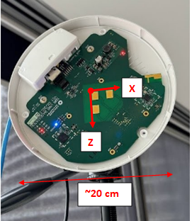

# Base Stations Transformation and Alignment Project
This project processes a set of base stations locaitons data from CSV files, calculates the rigid transformation between them, and merges the data into a single set aligned with a master station. The merged markers are plotted, and transformations to the master station are computed for each marker.

## Localisation of bases using Theodolite
The location of each reflective target is determined using the theodolite, and an orientation is obtained as shown in the figure below:



Once all orientations and locations of the markers are obtained, main.m computes the transformation between each marker and a master marker. The bases can be determined using one or more CSV files from the theodolite. A master terminal must be selected and specified in line 15 of main.m:

```
master = 2;
```

To merge two files containing data from different scans, both files must contain the location of markers around the same base station. The base station number can be updated by changing lines 18 and 19 in main.m:

```
test_1_station = 2;
test_2_station = 1;
```

If the axes are incorrect between the two readings due to errors during the scan, the section below can be updated to adjust the axis of the second scan (main.m lines 44-47):

```
inv_x = 0;
inv_y = 1;
inv_z = 1;
```

## Stations axes
If the output of the code for first scan does not match the axes of the base stations, the axes can be modified in 'readMarkers.m' by changing: 
```
v1 = points(2, :) - points(4, :);
v3 = points(3, :) - points(1, :);
v2 = cross(v1, v3);
```
 
Where each of the surveyed markers around the tag are numbered as 1-4 starting from the top and moving clockwise

## Master station as origin
Once all the stations have been transformed into the same axis, the master station is used as the origin and the rest of the stations are aligned accordingly. 

The location of the stations with master station as origin will be saved using the output file indicated in 
```
out_file = 'data/Test_10-04-24/station_locations.csv';
```
